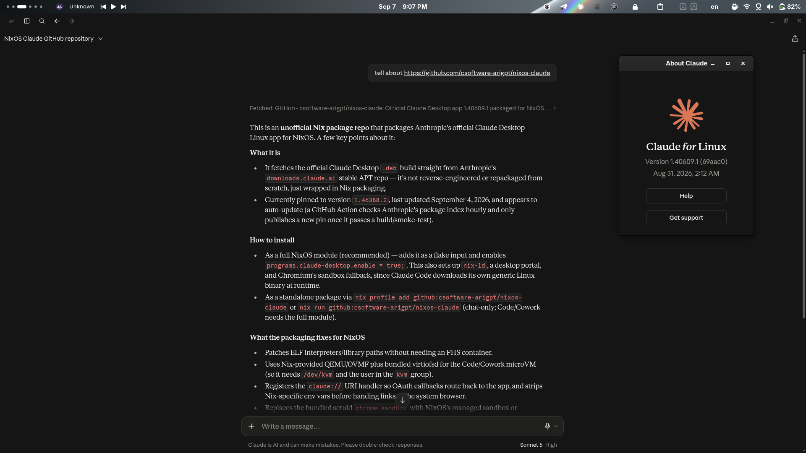

# Claude Desktop for NixOS

An unofficial Nix package for the **official Claude Desktop Linux application
by Anthropic**. The package is fetched only from Anthropic's official
[`downloads.claude.ai` stable repository](https://downloads.claude.ai/claude-desktop/apt/stable/).



Current packaged version: `2.7032.0`.
Last package update: `2026-09-23T16:57:07Z`.

## Full NixOS installation

Using the module is recommended because Claude Code downloads its own generic
Linux executable at runtime. The module enables `nix-ld` for that executable
and configures a desktop portal plus Chromium's SUID sandbox fallback; the
package itself supplies the patched QEMU, OVMF, and virtiofsd paths used by
Code and Cowork.

```nix
{
  inputs.claude-desktop.url = "github:csoftware-arigpt/nixos-claude";

  outputs = { nixpkgs, claude-desktop, ... }: {
    nixosConfigurations.my-host = nixpkgs.lib.nixosSystem {
      system = "x86_64-linux";
      modules = [
        claude-desktop.nixosModules.default
        {
          programs.claude-desktop.enable = true;
          users.users.YOUR_USER.extraGroups = [ "kvm" ];
        }
      ];
    };
  };
}
```

Replace `YOUR_USER`, then rebuild your system. Membership in `kvm` is required
for the Code/Cowork virtual machine and takes effect after logging in again.

## Install and run without the module

```bash
nix profile add github:csoftware-arigpt/nixos-claude && claude-desktop
```

Or run without installing:

```bash
nix run github:csoftware-arigpt/nixos-claude
```

Chat works with the standalone package. For the complete Code/Cowork setup,
use the NixOS module above.

Upgrade a profile installation:

```bash
nix profile upgrade nixos-claude
```

## What the package fixes for NixOS

- Patches ELF interpreters and runtime library paths without an FHS container.
- Uses Nix-provided QEMU and OVMF plus Anthropic's bundled virtiofsd for the
  Code/Cowork microVM.
- Enables Wayland/X11 auto-selection, desktop portals, keyring integration,
  links, and trash handling.
- Removes Nix-specific library variables before handing external links to the
  system browser, so OAuth works across independently updated configurations.
- Registers the `claude://` handler in the user's desktop MIME database so the
  browser can return OAuth callbacks to the running application.
- Removes the unusable bundled setuid `chrome-sandbox`; the launcher uses
  NixOS's managed Chromium sandbox when enabled and otherwise falls back to
  unprivileged user namespaces.

Hardware virtualization must be enabled in firmware and `/dev/kvm` must be
available. Verify it with:

```bash
test -r /dev/kvm -a -w /dev/kvm
```

## Updates and reproducibility

The exact version, immutable package URL, and SHA-256 are pinned in
`sources.nix`. GitHub Actions checks Anthropic's package index hourly and only
publishes a new pin after `nix flake check` builds and smoke-tests it.

To check or update manually:

```bash
nix develop -c ./scripts/update.sh
nix flake check --print-build-logs
```

The browser-facing latest download is
[`claude.ai/api/desktop/linux/x64/deb/latest/redirect`](https://claude.ai/api/desktop/linux/x64/deb/latest/redirect);
the build uses the same official release through Anthropic's stable APT
repository so Nix can fetch a reproducible, immutable URL.

## Supported platform

`x86_64-linux` is supported, matching Anthropic's x64 download linked above.

> This repository is not affiliated with Anthropic. Claude and the official
> binary package belong to Anthropic; this repository contains only the Nix
> packaging code.
